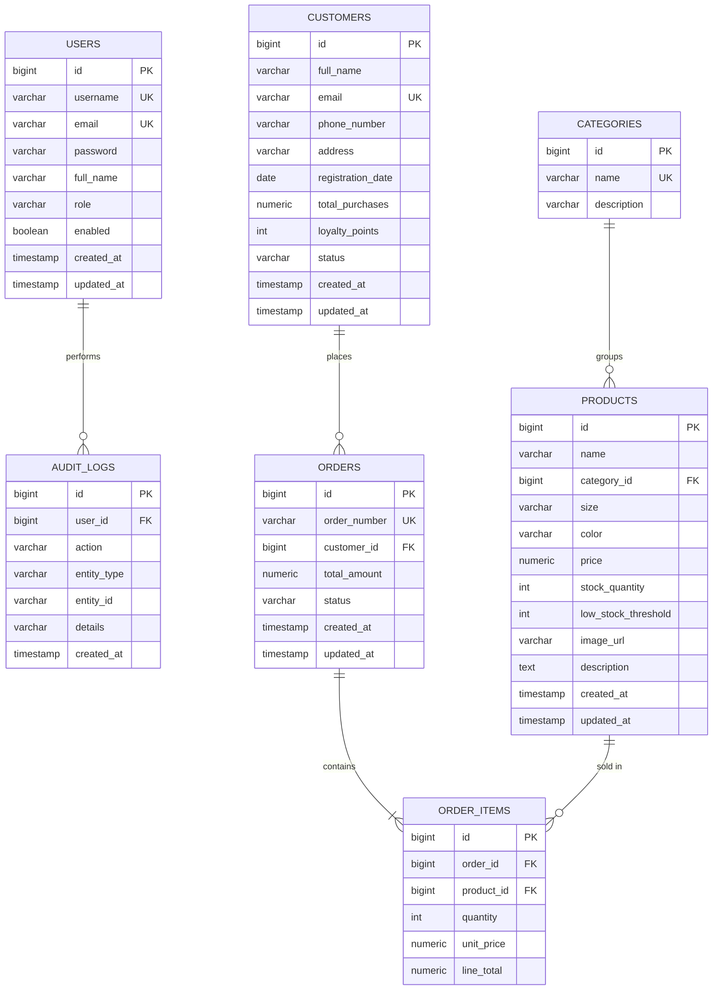

# StyleCRM — Clothing Store Management System with CRM

A complete, production-ready clothing store management system: **Spring Boot 3 / Java 21** REST backend with JWT security, a **vanilla HTML/CSS/JS** enterprise frontend, and **PostgreSQL**. Fully containerised with Docker, Nginx, and a GitHub Actions CI/CD pipeline targeting AWS EC2.

---

## 1. Features

| Module | Capabilities |
|---|---|
| **Auth & RBAC** | Login, registration, JWT, three roles: `ADMIN`, `SALES_MANAGER`, `EMPLOYEE` |
| **Dashboard** | Total customers / orders / products, monthly revenue, low-stock count, recent activity, 14-day sales chart |
| **CRM** | Customer CRUD, search, status, loyalty points, profile + purchase history, CSV export |
| **Products** | CRUD, categories, images, size/color, stock + low-stock threshold |
| **Orders** | Create (multi-line), status workflow, cancel (auto-restock), history |
| **Inventory** | Stock tracking, low-stock alerts, inventory report |
| **Reports** | Daily / weekly / monthly sales, top-selling products, customer analytics |
| **Platform** | Pagination, filtering, audit logs, activity tracking, global exception handling, OpenAPI/Swagger |

---

## 2. Project structure

```
clothing-crm/
├── backend/
│   ├── src/main/java/com/clothingstore/crm/
│   │   ├── CrmApplication.java
│   │   ├── config/        # SecurityConfig, OpenApiConfig, DataSeeder
│   │   ├── controller/    # REST controllers
│   │   ├── dto/           # Request/response DTOs (+ auth, order subpackages)
│   │   ├── entity/        # JPA entities + enums
│   │   ├── exception/     # Custom exceptions + GlobalExceptionHandler
│   │   ├── repository/    # Spring Data JPA repositories
│   │   ├── security/      # JWT provider, filter, user details
│   │   ├── service/       # Service interfaces
│   │   │   └── impl/      # Service implementations
│   │   └── util/          # Mappers
│   ├── src/main/resources/
│   │   ├── application.yml
│   │   ├── schema.sql     # DDL
│   │   └── data.sql       # Sample data
│   ├── Dockerfile
│   └── pom.xml
├── frontend/
│   ├── html  -> *.html (index, register, dashboard, customers, products, orders, inventory, reports)
│   ├── css/styles.css
│   ├── js/   (config, api, auth, ui, dashboard, customers, products, orders, inventory, reports)
│   ├── assets/
│   ├── Dockerfile
│   └── nginx.conf
├── .github/workflows/ci-cd.yml
├── docker-compose.yml
└── README.md
```

---

## 3. Quick start (Docker)

```bash
git clone <your-repo> clothing-crm && cd clothing-crm
docker compose up --build
```

- Frontend: http://localhost
- Backend API: http://localhost:8080/api
- Swagger UI: http://localhost:8080/swagger-ui.html

### Run locally without Docker

```bash
# 1. Start PostgreSQL and create the database
createdb clothing_crm

# 2. Backend
cd backend
export DB_URL=jdbc:postgresql://localhost:5432/clothing_crm
export DB_USERNAME=postgres DB_PASSWORD=postgres
mvn spring-boot:run

# 3. Frontend (any static server)
cd ../frontend && python3 -m http.server 5500
```

### Seeded demo accounts

| Username | Password | Role |
|---|---|---|
| `admin` | `password123` | ADMIN |
| `manager` | `password123` | SALES_MANAGER |
| `employee` | `password123` | EMPLOYEE |

---

## 4. ER Diagram



The authoritative DDL lives in [`backend/src/main/resources/schema.sql`](backend/src/main/resources/schema.sql); sample data in [`data.sql`](backend/src/main/resources/data.sql). With `spring.jpa.hibernate.ddl-auto=update` Hibernate also generates the schema from the entities, and `DataSeeder` inserts demo rows on first run.

---

## 5. API Documentation

All responses use a common envelope:

```json
{ "success": true, "message": "OK", "data": { }, "timestamp": "2026-06-11T20:00:00" }
```

Authenticate by sending `Authorization: Bearer <token>` on every protected call.

### Auth

| Method | Endpoint | Roles | Description |
|---|---|---|---|
| POST | `/api/auth/login` | public | Obtain JWT |
| POST | `/api/auth/register` | public | Create account |

**Request** `POST /api/auth/login`
```json
{ "username": "admin", "password": "password123" }
```
**Response**
```json
{
  "success": true,
  "message": "Login successful",
  "data": {
    "token": "eyJhbGciOiJIUzI1NiJ9...",
    "userId": 1, "username": "admin",
    "fullName": "System Administrator", "role": "ADMIN"
  }
}
```

### Customers

| Method | Endpoint | Roles |
|---|---|---|
| GET | `/api/customers?page=0&size=10&search=&status=` | all |
| GET | `/api/customers/{id}` | all |
| GET | `/api/customers/{id}/orders` | all |
| POST | `/api/customers` | ADMIN, SALES_MANAGER |
| PUT | `/api/customers/{id}` | ADMIN, SALES_MANAGER |
| DELETE | `/api/customers/{id}` | ADMIN, SALES_MANAGER |
| GET | `/api/customers/export` | ADMIN, SALES_MANAGER (CSV) |

**Request** `POST /api/customers`
```json
{
  "fullName": "Jane Doe",
  "email": "jane@example.com",
  "phoneNumber": "+1 555 0101",
  "address": "12 Market St",
  "status": "ACTIVE"
}
```

### Products & Categories

| Method | Endpoint | Roles |
|---|---|---|
| GET | `/api/products?page=&size=&search=&categoryId=` | all |
| GET | `/api/products/{id}` | all |
| POST | `/api/products` | ADMIN, SALES_MANAGER |
| PUT | `/api/products/{id}` | ADMIN, SALES_MANAGER |
| DELETE | `/api/products/{id}` | ADMIN |
| GET | `/api/categories` | all |
| POST | `/api/categories` | ADMIN, SALES_MANAGER |

**Request** `POST /api/products`
```json
{
  "name": "Classic Denim Jacket",
  "categoryId": 1,
  "size": "M", "color": "Blue",
  "price": 79.99,
  "stockQuantity": 40,
  "lowStockThreshold": 10,
  "imageUrl": "https://...",
  "description": "Unisex denim jacket"
}
```

### Orders

| Method | Endpoint | Roles |
|---|---|---|
| GET | `/api/orders?page=&size=&status=` | all |
| POST | `/api/orders` | all |
| PATCH | `/api/orders/{id}/status` | ADMIN, SALES_MANAGER |
| POST | `/api/orders/{id}/cancel` | ADMIN, SALES_MANAGER |

**Request** `POST /api/orders`
```json
{
  "customerId": 1,
  "items": [
    { "productId": 1, "quantity": 2 },
    { "productId": 3, "quantity": 1 }
  ]
}
```
**Request** `PATCH /api/orders/5/status`
```json
{ "status": "SHIPPED" }
```

### Dashboard, Inventory, Reports, Audit

| Method | Endpoint | Roles |
|---|---|---|
| GET | `/api/dashboard/stats` | all |
| GET | `/api/inventory/low-stock` | all |
| GET | `/api/inventory/report` | all |
| GET | `/api/reports/sales?period=daily\|weekly\|monthly` | ADMIN, SALES_MANAGER |
| GET | `/api/reports/top-products` | ADMIN, SALES_MANAGER |
| GET | `/api/reports/customer-analytics` | ADMIN, SALES_MANAGER |
| GET | `/api/audit-logs` | ADMIN |

Full interactive docs: **`/swagger-ui.html`**.

---

## 6. AWS EC2 Deployment

1. **Launch an instance** — Amazon Linux 2023 or Ubuntu 22.04, `t3.small`+. Open security-group inbound ports `22`, `80`, `443`.
2. **Install Docker**
   ```bash
   sudo yum update -y && sudo yum install -y docker        # Amazon Linux
   sudo systemctl enable --now docker
   sudo usermod -aG docker $USER
   sudo curl -L "https://github.com/docker/compose/releases/latest/download/docker-compose-$(uname -s)-$(uname -m)" -o /usr/local/bin/docker-compose
   sudo chmod +x /usr/local/bin/docker-compose
   ```
3. **Get the code**
   ```bash
   sudo mkdir -p /opt/clothing-crm && cd /opt/clothing-crm
   git clone <your-repo> .
   ```
4. **Set production secrets** (never commit these): create `/opt/clothing-crm/.env` and reference it from compose, or export `JWT_SECRET`, `DB_PASSWORD`, `CORS_ORIGINS=https://yourdomain.com`.
5. **Launch**
   ```bash
   docker compose up -d --build
   ```
6. **HTTPS** — point a domain at the instance and put TLS in front (AWS ALB + ACM, or add Certbot to the Nginx container).
7. **Verify** — `http://<ec2-public-ip>/` for the UI and `/swagger-ui.html` for the API.

---

## 7. CI/CD (GitHub Actions)

`.github/workflows/ci-cd.yml` runs on every push to `main`:

1. **build-and-test** — spins up Postgres, builds and tests the backend with Maven, uploads the jar.
2. **docker-publish** — builds backend + frontend images and pushes to GitHub Container Registry (`ghcr.io`).
3. **deploy** — SSHes into the EC2 host and runs `docker compose pull && up -d`.

Required repository **secrets**: `EC2_HOST`, `EC2_USER`, `EC2_SSH_KEY` (and registry permissions via the built-in `GITHUB_TOKEN`).

---

## 8. Security notes

- Passwords hashed with BCrypt; JWT signed HS256, expiry configurable via `JWT_EXPIRATION_MS`.
- Method-level RBAC with `@PreAuthorize`.
- Always replace `JWT_SECRET` and DB credentials in production.
- CORS origins are configurable through `CORS_ORIGINS`.
